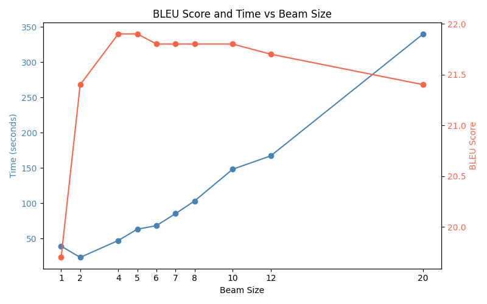

# MT Exercise 4: Byte Pair Encoding, Beam Search

This repository is a starting point for the 4th and final exercise. As before, fork this repo to your own account and then clone it into your preferred directory.

---

## Requirements

- Python 3.10 must be installed.
- `virtualenv` must be installed.

### Setup Instructions

**Clone your fork of the repository:**

       git clone https://github.com/[your-username]/mt-exercise-4
       cd mt-exercise-4 

**Create a virtual environment:**

       ./scripts/make_virtualenv.sh

Important: Activate the env by executing the source command that is output by the shell script above.
Install required dependencies.
Note: Make sure to make all scripts executable if they are not.

**Download data:**

       python ./scripts/download_huggingface_data.py --src it --trg en --out data

**Preprocess the data:**

       .scripts/preprocess.sh

This script can be used to preprocess the data, namely to learn a joint BPE model and build the joint vocabulary files for vocabulary sizes 2000 and 4000.

**Train all three models:**

       ./scripts/train.sh

This script can be used to train all models in sequence.

**Evaluate all three models:**

       ./scripts/evaluate.sh

This script can be used to evaluate all models in sequence.

**Run the beam code:**

       ./script/beam.sh

This script can be used to test a selected model for selected beam sizes. 

### Changes in the .yaml files

Added this at the end of the src and trg data entries for word segmentation:

        # either use a vocabulary limit:
        voc_limit: 2000

and added this for the bpe models, with the respective vocab files selected:

        # a file with a vocabulary built before starting the training:
        voc_file : "data/vocab_2k.joint"
        tokenizer_type: "subword-nmt"
        tokenizer_cfg:
            codes: "data/bpe_2k.codes"

The level is changed accordingly.

## Results

### Experiments with Byte Pair Encoding

**Translation direction:** Italian → English

| use BPE | vocabulary size | BLEU |
|--------|----------------|------|
| ✗      | 2000           | 8.4  |
| ✓      | 2000           | 21.3 |
| ✓      | 4000           | 21.9 |

Manual inspection of the translations reveals substantial differences both across vocabulary sizes and between the use of BPE coding and no coding. In [the accompanying PDF](a_alber_mt_exercise-4.pdf) reports 7 example sentences are presented, selected from the test output. It is evident that the non-BPE-coded sentences do not produce adequate translations: they are frequently difficult to understand, and in sentence 6 the output lacks linguistic content entirely. Sentence 7 is missing a key word that determines the meaning.

Comparing the 2,000 and 4,000 vocabulary conditions, results partially overlap (e.g., sentence 7), but the larger vocabulary does not consistently improve translation quality. The BLEU scores confirm this: increasing vocabulary size alone does not reliably improve performance under this setup.

---

### Beam Search

| Beam size | 1 | 2 | 4 | 5 | 6 | 7 | 8 | 10 | 12 | 20 |
|---|---|---|---|---|---|---|---|---|---|---|
| BLEU     | 19.7 | 21.4 | 21.9 | 21.9 | 21.8 | 21.8 | 21.8 | 21.8 | 21.7 | 21.4 |
| time (s) | 39 | 23 | 47 | 63 | 68 | 85 | 103 | 148 | 167 | 340 |

Beam size does not monotonically improve BLEU. The best score (21.9) is reached at beam size 5, after which performance plateaus and slightly degrades. Runtime increases with beam size in an approximately linear fashion, with a strong cost increase at larger beams (notably beam size 20).

Beam size 5 provides the best accuracy–runtime trade-off in this setup.

#### Some more plots (click to open):
- [Bubble Plot](https://aaannalenaaa.github.io/mt-exercise-04/results/beam_bleu_time_bubble.html)
- [Line Plot](https://aaannalenaaa.github.io/mt-exercise-04/results/beam_time_bleu.html)
